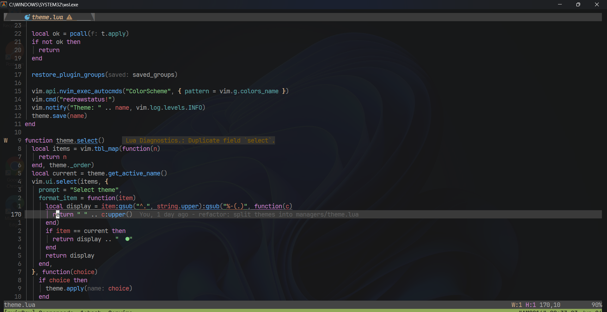
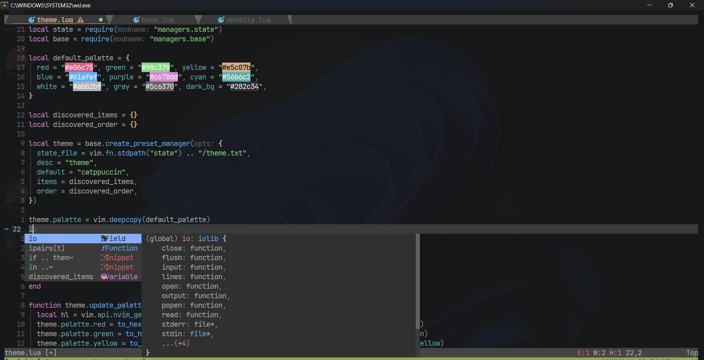
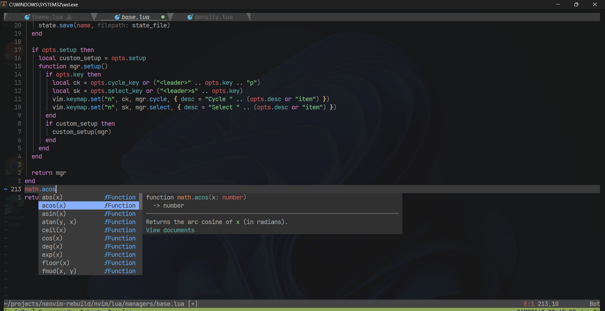
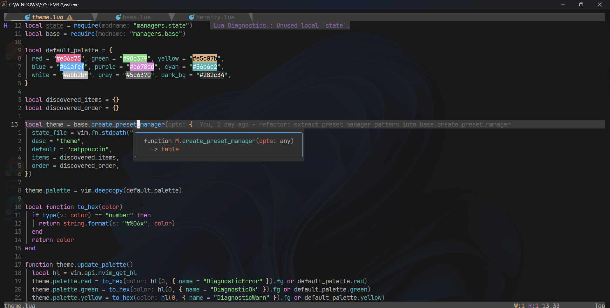
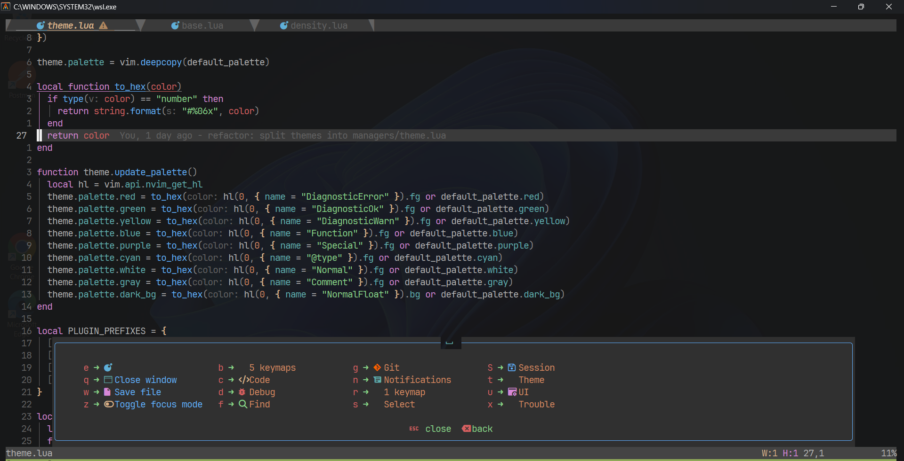
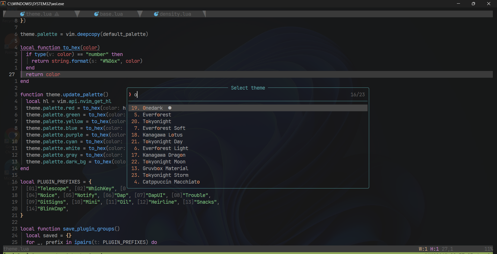

<p align="center">
  
</p>

<div align="center">
  <h1 align="center">Nvim IDE</h1>
  <p align="center">
    A framework-grade Neovim configuration with runtime-swappable subsystems,<br>
    multi-backend plugin management, and a clean modular architecture.
  </p>
</div>

<p align="center">
  
  
  
  
  
  
</p>

---

## Philosophy

| Principle | Why |
|-----------|-----|
| **Modular over monolithic** | Every concern has its own file, directory, and abstraction level. No sprawling 500-line configs. |
| **Swappable at runtime** | Pickers, completion engines, notification presets, and density levels switch live. No restart. |
| **Minimal startup overhead** | Lazy-load everything except what's needed for first keystroke. |
| **Framework-like architecture** | Managers, adapters, events, and profiles form a small but powerful framework that plugins sit on top of. |
| **Plugin-manager agnostic** | Unified plugin spec format works across 4 backends. Change one line to switch. |

---

## Gallery

<table>
  <tr>
    <td align="center" width="50%"><b>Code Editing</b></td>
    <td align="center" width="50%"><b>Auto Completion</b></td>
  </tr>
  <tr>
    <td align="center"></td>
    <td align="center"></td>
  </tr>
  <tr>
    <td align="center" width="50%"><b>Completion Menu</b></td>
    <td align="center" width="50%"><b>Hover Docs <code>Shift+K</code></b></td>
  </tr>
  <tr>
    <td align="center"></td>
    <td align="center"></td>
  </tr>
  <tr>
    <td align="center" width="50%"><b>Which-Key Popup</b></td>
    <td align="center" width="50%"><b>Theme Selector</b></td>
  </tr>
  <tr>
    <td align="center"></td>
    <td align="center"></td>
  </tr>
</table>

---

## Features

### Core System

| Area | Implementation | Swappable |
|------|---------------|:---------:|
| Plugin Manager | Lazy.nvim / pckr.nvim / mini.deps / vim.pack | Yes |
| Picker | Telescope + Snacks | Yes |
| Completion | blink.cmp | Adapter-ready |
| UI Density | Full / Compact / Minimal profiles | Yes |
| Notifications | noice.nvim + nvim-notify (3 presets) | Yes |
| Themes | 7 color schemes, 22+ variants | Yes |

### Language & Tooling

| Area | Implementation |
|------|---------------|
| LSP | nvim-lspconfig + mason.nvim (auto-install) |
| Formatting | conform.nvim |
| Linting | nvim-lint |
| Debugging | nvim-dap + nvim-dap-ui |
| Treesitter | Syntax highlighting, folding, indentation |
| Snippets | LuaSnip + friendly-snippets |

### UI & Experience

| Area | Implementation |
|------|---------------|
| Statusline | Heirline (3 density-aware layouts) |
| Bufferline | bufferline.nvim |
| Dashboard | Snacks dashboard |
| Git | gitsigns.nvim (inline blame, hunk ops) |
| Indent guides | indent-blankline.nvim (theme-aware) |
| Session | persistence.nvim |
| Which-Key | Interactive keybinding discovery |
| Diagnostics | trouble.nvim |

---

## Quick Start

```bash
git clone https://github.com/<your-org>/nvim ~/.config/nvim
nvim --headless "+lua require('config.plugin_manager')" +qa
```

Then open `nvim` and:

| Key | Action |
|-----|--------|
| `<Space>` | See which-key popup |
| `<leader>ff` | Find files |
| `<leader>tc` | Cycle themes |
| `<leader>fp` | Switch picker (Telescope ↔ Snacks) |

### Requirements

- **Neovim >= 0.11**
- **git**
- A [Nerd Font](https://www.nerdfonts.com/) (optional, for icons)
- Language-specific LSP servers (auto-installed via mason.nvim)

---

## Architecture

```
init.lua
  └── core/              # Bootstrap (options, keymaps, autocmds)
       └── config/       # Plugin manager selection, LSP servers
            └── plugins/ # 35+ adapter-agnostic plugin specs
                 └── managers/   # Abstraction layer (the "framework")
                      ├── adapter system       # Picker, completion, PM
                      ├── preset system        # Density, notifications
                      ├── event bus            # Cross-manager pub/sub
                      ├── state persistence    # User pref storage
                      └── theme system         # 7 families, 22 variants
                           └── statusline/ # Heirline (3 layouts)
```

### The Adapter Layer

```
Plugin Specs (universal format)
       │
       ▼
Plugin Manager Adapter        ─── Lazy.nvim     (default, 160 lines)
  translates triggers, ops     ─── pckr.nvim    (355 lines)
  to backend-native format      ─── mini.deps   (440 lines)
                                ─── vim.pack    (492 lines)
```

**One spec format, four backends.** Change your plugin manager by editing one line in `lua/config/plugin_manager.lua`.

---

## Key Highlights

| Feature | How |
|---------|-----|
| **Runtime-switchable pickers** | `:lua require("managers.picker").cycle()` toggles Telescope ↔ Snacks live |
| **Runtime-switchable completion** | Swap completion engines without restart |
| **Density presets** | Full IDE → Compact → Minimal — adjusts statusline, bufferline, indent guides, and notifications simultaneously |
| **Theme variants** | 22+ across 7 families with full plugin highlight restoration |
| **Event bus** | `managers.events` — pub/sub decouples managers from each other |
| **Dependency resolution** | Topological sort with cycle detection for plugin specs |
| **Spec validation** | Auto-checks all 35+ specs for errors at load time |
| **Enable/disable plugins** | Toggle plugins at runtime by name or category |
| **State persistence** | Theme, density, picker, focus mode — all survive restarts |

---

## Documentation

| Section | Covers |
|---------|--------|
| [Getting Started](docs/getting-started/installation.md) | Installation, requirements, first launch, updating |
| [Architecture](docs/architecture/overview.md) | Repo structure, startup flow, lazy-loading, dependency graph |
| [Plugins](docs/plugins/plugin-system.md) | Every plugin: purpose, configuration, extension points |
| [Themes](docs/themes/theme-system.md) | Theme system, switching, creating new themes |
| [Keymaps](docs/keymaps/keymaps-overview.md) | Complete key reference, leader mappings, which-key |
| [Development](docs/development/adding-a-plugin.md) | Adding/removing plugins, coding standards, debugging |
| [Workflows](docs/workflows/startup-sequence.md) | Startup, search, LSP, completion, formatting flow |
| [Performance](docs/performance/startup-optimization.md) | Startup optimization, lazy-loading strategy, benchmarks |
| [Customization](docs/customization/user-options.md) | User overrides, creating modules, extending features |
| [Reference](docs/reference/commands.md) | Commands, autocommands, options, globals, env vars |
| [Troubleshooting](docs/troubleshooting/common-issues.md) | Common issues, FAQ |
| [Decisions](docs/decisions/why-this-architecture.md) | Architecture decisions, design rationale, comparisons |

---

## Built With

<p>
  
  
  
  
  
  
</p>

---

## License

MIT

---

<p align="center">
  <sub>Built with Neovim + Lua + a lot of adapter patterns.</sub><br>
  <sub>Questions? Open an issue.</sub>
</p>
