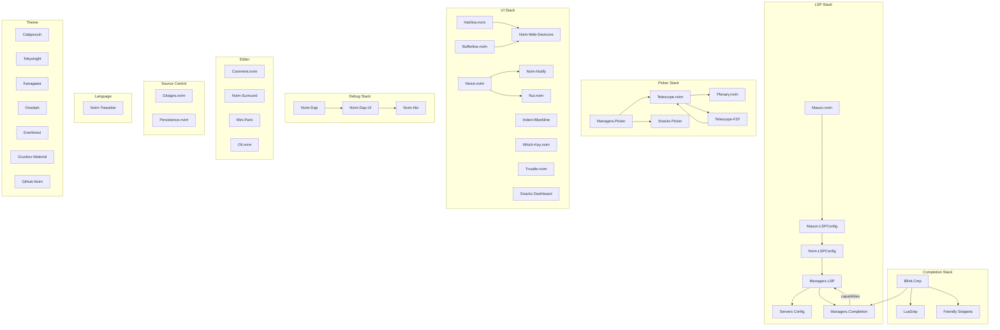
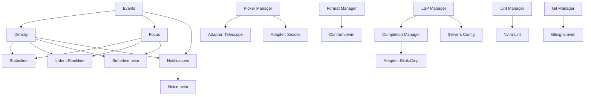

# Dependency Graph

## Plugin Dependencies

## Manager Dependencies

## Runtime Dependency Order

| Phase | Module | Depends On |
|---|---|---|
| 0 | `core/options.lua` | nothing |
| 1 | `themes/init.lua` | nothing (discovers at runtime) |
| 2 | `managers/events.lua` | nothing |
| 3 | `managers/density.lua` | events |
| 4 | `managers/focus.lua` | events |
| 5 | `managers/notifications.lua` | events |
| 6 | `managers/completion/init.lua` | nothing (discovers adapters at runtime) |
| 7 | `managers/picker/init.lua` | nothing (discovers adapters at runtime) |
| 8 | `core/keymaps.lua` | themes, density, focus, notifications, completion, picker |
| 9 | `config/lazy.lua` | nothing (bootstraps Lazy.nvim) |
| 10+ | Plugin config functions | various managers |

## Circular Dependency Prevention

The event bus (`managers/events.lua`) prevents circular dependencies. Instead of:

- `density` directly calling `notifications.apply()`

It does:

- `density` calls `events.emit("notifications_apply", ...)`
- `notifications` subscribes to `events.on("notifications_apply", ...)`

This pattern is used for:

- `density → notifications_apply`
- `density → focus_changed`
- `focus → focus_changed`
- `notifications → notifications_apply`

---

**Previous:** [Lazy Loading](lazy-loading.md)
**Next:** [Abstractions](abstractions.md)
