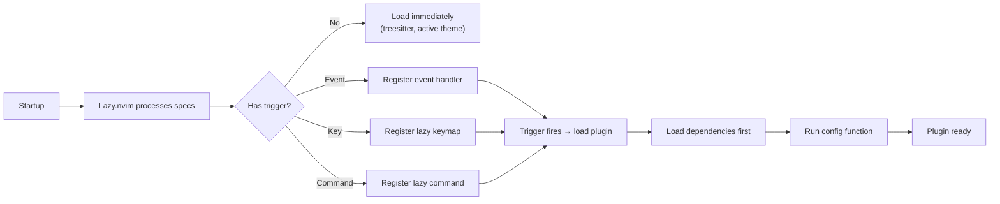

# Lazy Loading Strategy

## Principles

1. **Nothing loads at startup unless it must** — the only non-lazy plugin is `nvim-treesitter` (needed for syntax highlighting on first keystroke).
2. **Lazy-load triggers are precise** — every plugin spec defines exactly when it should load (event, key, command, or filetype).
3. **Plugin groups** — related plugins (e.g., LSP: mason + mason-lspconfig + lspconfig) are grouped so they load together when one is triggered.
4. **Adapters are lazy** — picker and completion adapters only load when their respective managers dispatch to them.

## Loading Triggers

This table documents every plugin and its loading trigger:

| Plugin | Trigger | Why |
|---|---|---|
| `nvim-treesitter` | `lazy = false` | Must be available for syntax highlighting on first file open |
| `conform.nvim` | `event = {"BufReadPre", "BufNewFile"}` | Formatting config ready when file opens |
| `nvim-lint` | `event = {"BufReadPre", "BufNewFile"}` | Linting config ready when file opens |
| `persistence.nvim` | `event = "BufReadPre"` | Session restore before file reads |
| `which-key.nvim` | `event = "VeryLazy"` | Popup helper, not needed immediately |
| `heirline.nvim` | `event = "VeryLazy"` | Statusline not needed during startup |
| `bufferline.nvim` | `event = "VeryLazy"` | Buffer tabs not needed during startup |
| `noice.nvim` | `event = "VeryLazy"` | Notification UI not needed during startup |
| `nvim-notify` | `event = "VeryLazy"` | Notification backend, loaded by noice |
| `indent-blankline.nvim` | `event = "VeryLazy"` | Indent guides not needed during startup |
| `oil.nvim` | `lazy = true` (default) | Loaded on `:Oil` command |
| `trouble.nvim` | `cmd = "Trouble"` | Loaded on `:Trouble` command or keymaps |
| `telescope.nvim` | `lazy = true` (default) | Loaded on first picker invocation |
| `telescope-fzf-native.nvim` | `lazy = true` (default) | Loaded with telescope |
| `snacks.nvim` (dashboard) | `lazy = true` (default) | Loaded on dashboard open |
| `snacks.nvim` (picker) | lazy via spec | Loaded via picker manager dispatch |
| `blink.cmp` | `lazy = true` (default) | Loaded on insert enter |
| `LuaSnip` | via blink.cmp dependency | Loaded when blink requires it |
| `nvim-dap` | `keys` (leader d*) | Loaded on first debug keypress |
| `nvim-dap-ui` | dependency | Loaded with nvim-dap |
| `gitsigns.nvim` | not specified (default lazy) | Loaded on `BufRead` |
| `Comment.nvim` | not specified | Loaded on keymaps |
| `nvim-surround` | not specified | Loaded on keymaps |
| `mini.pairs` | not specified | Loaded on `InsertEnter` |
| Colorscheme plugins | `lazy = active_group ~= "name"` | Only non-active themes are lazy |

## Priority System

Non-lazy plugins use `priority` to determine load order:

| Priority | Plugin | Reason |
|---|---|---|
| `1000` | Colorscheme plugins | Must load before UI plugins so highlights propagate correctly |
| (default) | nvim-treesitter | Loads after colorschemes |

## Event-Driven Loading

The `VeryLazy` event is used for purely cosmetic plugins that have no impact on editing functionality:

- Statusline (heirline)
- Bufferline
- Notifications (noice + notify)
- Indent guides (indent-blankline)
- Which-key

These plugins typically add ~5-15ms to startup when deferred to `VeryLazy`, compared to 30-80ms if loaded eagerly.

## Keymap-Driven Loading

`nvim-dap` is loaded via keymaps. The spec declares:

```lua
keys = {
  { "<leader>db", function() require("dap").toggle_breakpoint() end, desc = "Toggle Breakpoint" },
  ...
}
```

Lazy.nvim registers these as lazy keymaps. When the user presses `<leader>db`, Lazy loads `nvim-dap` (and its dependencies), then executes the function.

## Command-Driven Loading

`trouble.nvim` loads on `:Trouble`:

```lua
cmd = "Trouble"
```

Lazy registers the `Trouble` command. When invoked, Lazy loads `trouble.nvim` and its dependencies before executing the command.

## FileType-Driven Loading

Not currently used explicitly in specs, but `conform.nvim` and `nvim-lint` use `BufReadPre`/`BufNewFile` events, which effectively achieve per-filetype lazy loading.

## How It Works



---

**Previous:** [Startup Flow](startup-flow.md)
**Next:** [Dependency Graph](dependency-graph.md)
**See also:** [Startup Optimization](../performance/startup-optimization.md)
