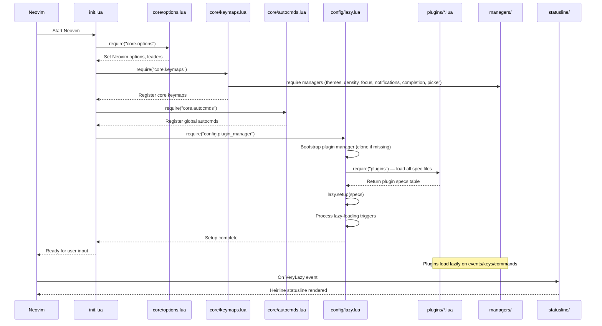

# Startup Flow

## Sequence Diagram



## Step-by-Step

### 1. `init.lua` (5 lines)

```lua
require("core.options")
require("core.keymaps")
require("core.autocmds")
require("config.plugin_manager")
```

This is the single entry point. It loads modules in dependency order:

1. **Options** — sets `vim.opt` values, `vim.g.mapleader`, and `vim.g.maplocalleader`. No dependencies.
2. **Keymaps** — registers global keybindings and **loads all manager modules** that define their own keymaps (themes, density, focus, notifications, completion, picker). These managers register keymaps at `require` time.
3. **Autocmds** — registers `TextYankPost` highlight. Standalone.
4. **Lazy** — bootstraps Lazy.nvim if not installed, then loads all plugin specs.

### 2. `core/options.lua`

Sets core Neovim options:

- `number`, `relativenumber` — line numbers.
- `expandtab`, `shiftwidth`, `tabstop` — 4-space indentation.
- `ignorecase`, `smartcase` — case-insensitive search with smart casing.
- `cursorline` — highlight current line.
- `splitbelow`, `splitright` — intuitive split behavior.
- `scrolloff` — keep 8 lines of context.
- `termguicolors` — truecolor support.
- `foldmethod`, `foldexpr` — Treesitter-based folding.
- `foldlevel` — start with all folds open.

Also sets `mapleader` to `<Space>` and `maplocalleader` to `\`.

### 3. `core/keymaps.lua`

Registers global keymaps and triggers manager loading:

```lua
require("themes")              -- registers theme keymaps (<leader>tc, <leader>ts, <leader>st)
require("managers.density")     -- registers density keymaps (<leader>uc, <leader>sd)
require("managers.focus")       -- registers focus keymaps (<leader>z)
require("managers.notifications") -- registers notification keymaps (<leader>nn, <leader>sn)
require("managers.completion")  -- registers completion keymaps (<leader>cp, <leader>sc)
```

Then registers the file picker maps:

```lua
local picker = require("managers.picker")
vim.keymap.set("n", "<leader>ff", picker.find_files, ...)
```

### 4. `core/autocmds.lua`

Registers `TextYankPost` autocmd to highlight yanked text.

### 5. `config/lazy.lua`

The Lazy.nvim bootstrap process:

1. Computes `lazypath` = `stdpath("data") .. "/lazy/lazy.nvim"`.
2. If not installed, clones `folke/lazy.nvim` with `--filter=blob:none --branch=stable`.
3. Prepends `lazypath` to `rtp`.
4. Calls `require("lazy").setup("plugins")` which auto-discovers all files in `lua/plugins/`.

### 6. Plugin Loading (Lazy)

Lazy.nvim processes all plugin specs from `lua/plugins/`. Each spec defines:

- **lazy** — whether to lazy-load (default: `true`).
- **event** — Neovim events that trigger loading.
- **keys** — keymaps that trigger loading.
- **cmd** — commands that trigger loading.
- **ft** — filetypes that trigger loading.
- **priority** — for non-lazy plugins, load order priority.
- **dependencies** — ensure dependencies load first.

See [Lazy Loading](lazy-loading.md) for details.

### 7. Manager Setup

When plugins _do_ load (triggered by events/keys/commands), their `config()` functions call into managers:

- `conform.nvim` → `managers.format.setup()`
- `nvim-lint` → `managers.lint.setup()`
- `gitsigns.nvim` → `managers.git.setup()`
- `nvim-lspconfig` → `managers.lsp.setup()`
- `heirline.nvim` → `statusline.set_layout("full")`

### 8. Deferred Operations

Several operations happen on `vim.schedule()` to avoid blocking startup:

- **Density restore** (`managers/density.lua:192`): if the user had a non-default density preset, it's applied after startup.
- **Notification restore** (`managers/notifications.lua:265`): if the user had a non-rich notification preset, it's applied after startup.
- **Treesitter install** (`plugins/treesitter.lua:36`): missing parsers are installed after `UIEnter`.

---

**Previous:** [Repository Structure](repository-structure.md)
**Next:** [Lazy Loading](lazy-loading.md)
**See also:** [Abstractions](abstractions.md)
