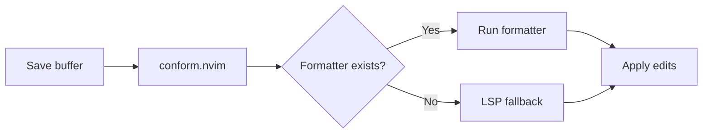

# Formatting & Linting

## Formatting: conform.nvim

**File:** `lua/plugins/formatting.lua` → `lua/managers/format/init.lua`

- **Purpose:** Asynchronous code formatting with multiple formatter support.
- **Why conform.nvim:** Actively maintained, supports LSP fallback, simple configuration.
- **Alternatives:** `null-ls` (unmaintained), `none-ls` (community fork), `efm-langserver`.
- **Lazy loading:** `event = { "BufReadPre", "BufNewFile" }`.

### Architecture



### Configuration

See [Formatting Flow](../workflows/formatting-flow.md) for full details.

### Keymaps

| Key | Action |
|---|---|
| `<leader>cf` | Format current buffer |

## Linting: nvim-lint

**File:** `lua/plugins/linting.lua` → `lua/managers/lint/init.lua`

- **Purpose:** Asynchronous linting using external linters.
- **Why nvim-lint:** Lightweight, extensible, integrates with Neovim's diagnostic API.
- **Alternatives:** `null-ls`, `efm-langserver`, ALE.
- **Lazy loading:** `event = { "BufReadPre", "BufNewFile" }`.

### Architecture


### Configuration

Currently configured for Lua only:

```lua
linters_by_ft = {
  lua = { "selene" },
}
```

### Linter Availability Check

`lua/managers/lint/init.lua` checks that the linter binary exists on `$PATH` before running:

```lua
function M._available(names)
  for _, name in ipairs(names) do
    local cmd = linter.cmd or name
    if vim.fn.executable(cmd) == 1 then
      table.insert(result, name)
    end
  end
  return result
end
```

### Adding a Linter

1. Add the filetype mapping in `lua/plugins/linting.lua`:
   ```lua
   linters_by_ft = {
     lua = { "selene" },
     python = { "ruff" },
     javascript = { "eslint" },
   }
   ```
2. Install the linter binary (via Mason or system package manager).

---

**Up:** [Plugin System](plugin-system.md)
**See also:** [Diagnostics Flow](../workflows/diagnostics-flow.md)
