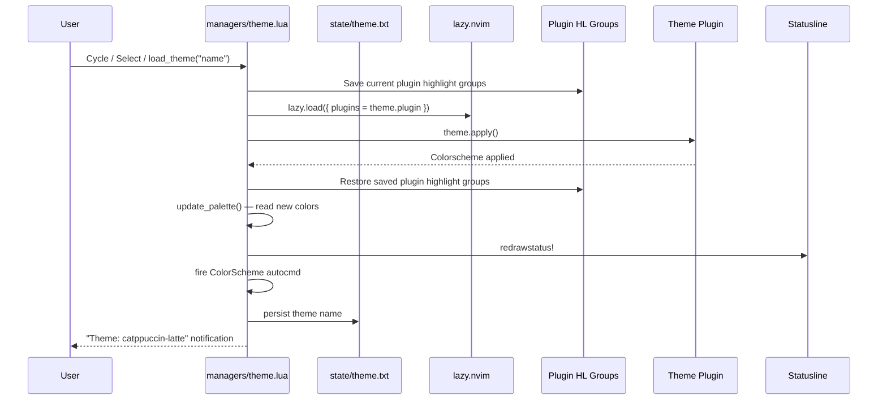

# Switching Themes

## Interactive Theme Selection

### Via Keymaps

| Key | Action |
|---|---|
| `<leader>tc` | Cycle to next theme (alphabetically) |
| `<leader>ts` | Display current theme name |
| `<leader>st` | Open `vim.ui.select` picker to choose a theme |

### Via Command

```vim
:lua require("managers.theme").apply("tokyonight-storm")
```

### Via Lua

```lua
local theme = require("managers.theme")
theme.apply("catppuccin-latte")
```

## What Happens During a Theme Switch



## Why Plugin Highlights Are Saved

When a theme switches, Neovim clears and re-applies all highlight groups. This resets plugin-specific highlights (Telescope selection colors, WhichKey borders, BufferLine active tab, etc.). By saving and restoring known plugin groups, the theme system ensures plugin UI remains consistent across theme switches.

The list of plugin prefixes that are preserved is in `lua/managers/theme.lua:43`:

```lua
PLUGIN_PREFIXES = {
  "Telescope", "WhichKey", "BufferLine", "Buffer",
  "Noice", "Notify", "Dap", "DapUI", "Trouble",
  "GitSigns", "Mini", "Oil", "Heirline", "Snacks", "BlinkCmp",
}
```

## Performance

Theme switching is nearly instant (<100ms) because:

1. Only the active theme's plugin is loaded lazily (others stay unloaded).
2. Only known plugin prefixes are saved/restored (not all 1000+ highlight groups).
3. Palette extraction reads only 9 specific highlight groups.

---

**Previous:** [Theme System](theme-system.md)
**Next:** [Creating New Themes](creating-new-themes.md)
