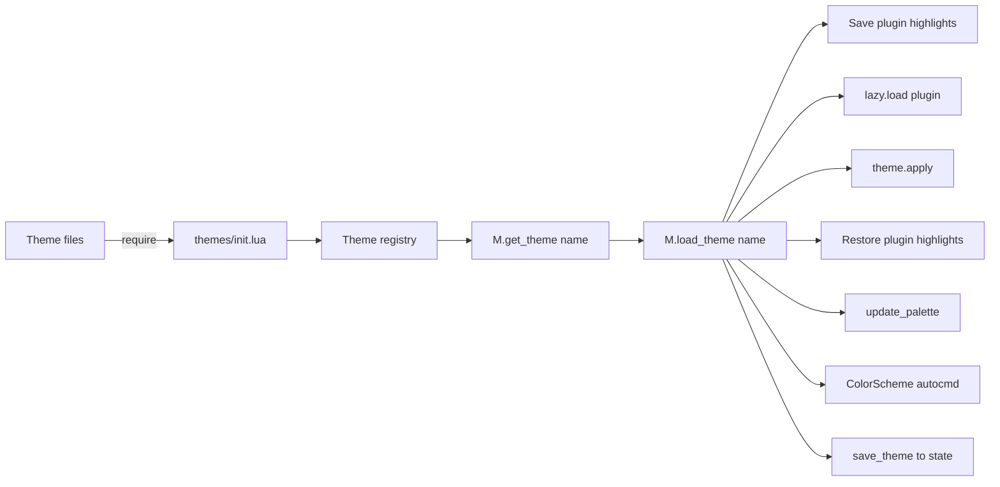

# Theme System

## Overview

The theme system (`lua/themes/init.lua`) is a self-contained manager that:

1. **Auto-discovers** theme files in `lua/themes/`.
2. **Registers variants** (e.g., catppuccin has 4 variants: mocha, macchiato, frappe, latte).
3. **Manages switching** at runtime with plugin highlight preservation.
4. **Extracts palette** for use by statusline and other UI components.
5. **Persists** the active theme across sessions.

## Architecture



## Theme File Format

Each theme file in `lua/themes/` returns a list of entries:

```lua
-- lua/themes/catppuccin.lua
return {
  {
    name = "catppuccin",           -- Unique identifier (used for switching)
    plugin = "catppuccin",         -- Lazy.nvim plugin name (for lazy.load)
    group = "catppuccin",          -- Colorscheme group (for lazy-load optimization)
    apply = function()             -- Function that activates the theme
      require("catppuccin").setup({ flavour = "mocha", ... })
      vim.cmd.colorscheme("catppuccin")
    end,
  },
  -- ... more variants
}
```

### Entry Fields

| Field | Required | Description |
|---|---|---|
| `name` | Yes | Unique theme identifier (e.g., `"catppuccin-latte"`) |
| `plugin` | No | Plugin name for `lazy.load()` when switching from another theme. Omit if the theme doesn't require a plugin. |
| `group` | No | Group identifier used in `lua/plugins/colorschemes.lua` to determine if this theme should be lazy-loaded. |
| `apply` | Yes | Function that sets up and applies the colorscheme. |

## How Theme Switching Works

When `M.load_theme(name)` is called:

1. **Save plugin highlights**: All highlight groups matching known plugin prefixes (Telescope, WhichKey, BufferLine, Noice, Notify, Dap, DapUI, Trouble, GitSigns, Mini, Oil, Heirline, Snacks, BlinkCmp) are saved.

2. **Load theme plugin**: `require("lazy").load({ plugins = theme.plugin })` ensures the theme's plugin is loaded.

3. **Apply theme**: `theme.apply()` runs the theme's setup and colorscheme command.

4. **Restore plugin highlights**: Previously saved plugin highlights are restored — this prevents theme switches from breaking plugin-specific UI colors.

5. **Update palette**: `M.update_palette()` reads the new theme's highlight groups and updates the shared palette.

6. **Fire ColorScheme autocmd**: Ensures all listeners (bufferline, indent-blankline, etc.) re-apply their highlights.

7. **Redraw statusline**: `vim.cmd("redrawstatus!")` forces statusline refresh.

8. **Save**: Persists the theme name to `state/theme.txt`.

## Palette Extraction

After theme application, `M.update_palette()` extracts colors from highlight groups:

```lua
M.palette = {
  red    = DiagnosticError.fg    -- fallback: "#e06c75"
  green  = DiagnosticOk.fg       -- fallback: "#98c379"
  yellow = DiagnosticWarn.fg     -- fallback: "#e5c07b"
  blue   = Function.fg           -- fallback: "#61afef"
  purple = Special.fg            -- fallback: "#c678dd"
  cyan   = @type.fg              -- fallback: "#56b6c2"
  white  = Normal.fg             -- fallback: "#abb2bf"
  gray   = Comment.fg            -- fallback: "#5c6370"
  dark_bg= NormalFloat.bg        -- fallback: "#282c34"
}
```

This palette is used by the statusline (`lua/statusline/init.lua`) for dynamic coloring that adapts to the active theme.

## Persistence

The active theme is saved to `vim.fn.stdpath("state") .. "/theme.txt"`. On startup, the theme system reads this file and sets the active theme. If the file doesn't exist, it defaults to `"catppuccin"`.

## Light Variant Detection

The theme system tracks which variants are light:

```lua
light_variants = {
  ["tokyonight-day"] = true,
  ["kanagawa-lotus"] = true,
  ["catppuccin-latte"] = true,
  ["everforest-light"] = true,
  ["github-light"] = true,
  ["github-light-high-contrast"] = true,
}
```

This is used by `M.is_light_variant(name)` and consumed by theme configs that need different settings for light/dark backgrounds.

## Keymaps

| Key | Action |
|---|---|
| `<leader>tc` | Cycle through all installed themes |
| `<leader>ts` | Show current theme name |
| `<leader>st` | Select theme via `vim.ui.select` |

---

**Previous:** [Creating New Themes](creating-new-themes.md) (next)
**Next:** [Switching Themes](switching-themes.md)
**See also:** [Theme Plugin Specs](../plugins/plugin-system.md) (colorschemes.lua)
