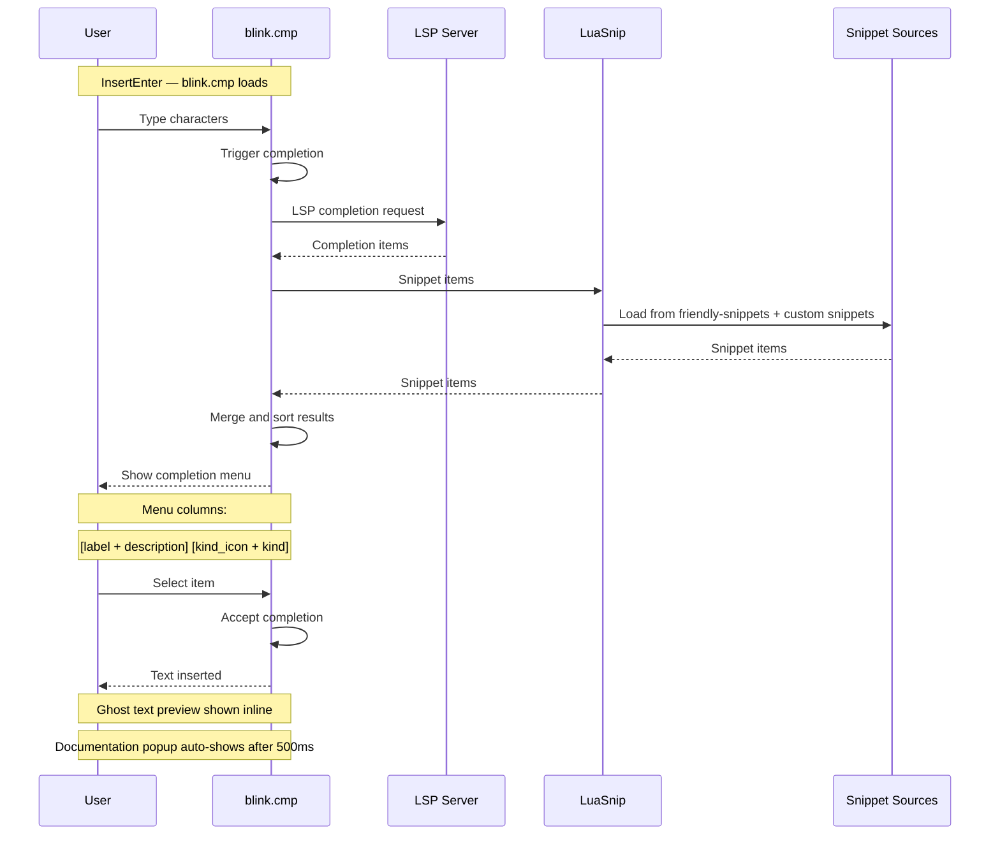

# Completion Workflow

## Event Flow



## Source Priority

blink.cmp is configured with these sources in order:

```lua
sources = {
  default = { "lsp", "path", "snippets", "buffer" },
}
```

1. **lsp** — Language server completions (highest priority).
2. **path** — File path completions.
3. **snippets** — LuaSnip snippets (from friendly-snippets and custom).
4. **buffer** — Words from current buffer.

## Snippet Loading

LuaSnip loads snippets lazily:

```lua
-- Load from friendly-snippets package
require("luasnip.loaders.from_vscode").lazy_load()

-- Load custom snippets from config directory
require("luasnip.loaders.from_vscode").lazy_load({
  paths = { vim.fn.stdpath("config") .. "/snippets" },
})
```

Custom snippets go in `~/.config/nvim/snippets/` in VSCode format.

## Capability Propagation

```
blink.cmp.get_lsp_capabilities()
  → managers/completion/adapters/blink_cmp.lua
    → managers/completion/init.lua (get_capabilities)
      → managers/lsp/init.lua (setup)
        → vim.lsp.config("*", { capabilities })
```

## Runtime Engine Switching

When `<leader>cp` is pressed:

1. `managers.completion.cycle()` rotates to the next adapter.
2. `M.use(name)` sets the active adapter and persists.
3. LSP capabilities are re-applied via `vim.lsp.config`.
4. A notification advises restarting the session for a full engine swap.

---

**See also:** [Completion Plugin](../plugins/completion.md), [LSP Flow](lsp-flow.md), [Completion Adapter System](../architecture/abstractions.md#3-completion-adapter-system-managerscompletion)
