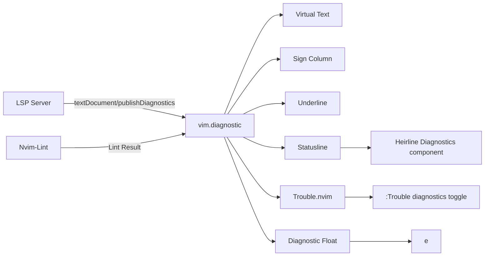

# Diagnostics Workflow

## Sources

Diagnostics come from two sources:

1. **LSP servers** — via `nvim-lspconfig` (real-time as you type).
2. **Linters** — via `nvim-lint` (on events: write, read, insert leave).

## LSP Diagnostics

Configured in `lua/managers/lsp/init.lua`:

```lua
vim.diagnostic.config({
  virtual_text = { prefix = "", source = true },
  signs = true,
  underline = true,
  update_in_insert = false,
  severity_sort = true,
  float = { border = "rounded", source = true },
})
```

- **Virtual text**: Shows error message at end of line with source name.
- **Signs**: Icons in the sign column.
- **Underline**: Underlines the problematic code.
- **Float**: Rounded border with source information.

## Lint Diagnostics

Configured in `lua/managers/lint/init.lua`:

```lua
local lint_timer
vim.api.nvim_create_autocmd(events, {
  group = vim.api.nvim_create_augroup("nvim-lint", { clear = true }),
  callback = function()
    local names = M._available(lint.linters_by_ft[vim.bo.filetype] or {})
    if #names == 0 then return end
    if lint_timer then lint_timer:stop() end
    lint_timer = (vim.uv or vim.loop).new_timer()
    lint_timer:start(100, 0, vim.schedule_wrap(function()
      lint.try_lint(vim.list_extend({}, names))
    end))
  end,
})
```

- **Debounced**: 100ms timer prevents re-linting on rapid events.
- **Available check**: Only linters whose binary exists on `$PATH` are used.
- **Events**: `BufWritePost`, `BufReadPost`, `InsertLeave`.
- **Per-filetype**: Currently configured for Lua (`selene`).

## Diagnostic Display Pipeline



## Diagnostic Navigation

| Key | Action |
|---|---|
| `[d` | Previous diagnostic |
| `]d` | Next diagnostic |
| `<leader>e` | Show diagnostic float for current line |
| `<leader>xx` | Toggle Trouble diagnostics panel |
| `<leader>xX` | Toggle buffer-local diagnostics |

## Statusline Display

The statusline (`lua/statusline/init.lua`) shows diagnostics counts via the `Diagnostics` component:

```lua
local Diagnostics = {
  condition = function() return #vim.diagnostic.get(0) > 0 end,
  init = function(self)
    self.errors = #vim.diagnostic.get(0, { severity = ERROR })
    self.warnings = #vim.diagnostic.get(0, { severity = WARN })
    self.hints = #vim.diagnostic.get(0, { severity = HINT })
  end,
  { provider = " {errors} " },
  { provider = " {warnings} " },
  { provider = " {hints} " },
}
```

Updates on `DiagnosticChanged` and `BufEnter` events.

---

**See also:** [LSP Flow](lsp-flow.md), [Formatting Flow](formatting-flow.md), [Trouble Plugin](../plugins/ui.md#trouble-luapluginstroublelua)
