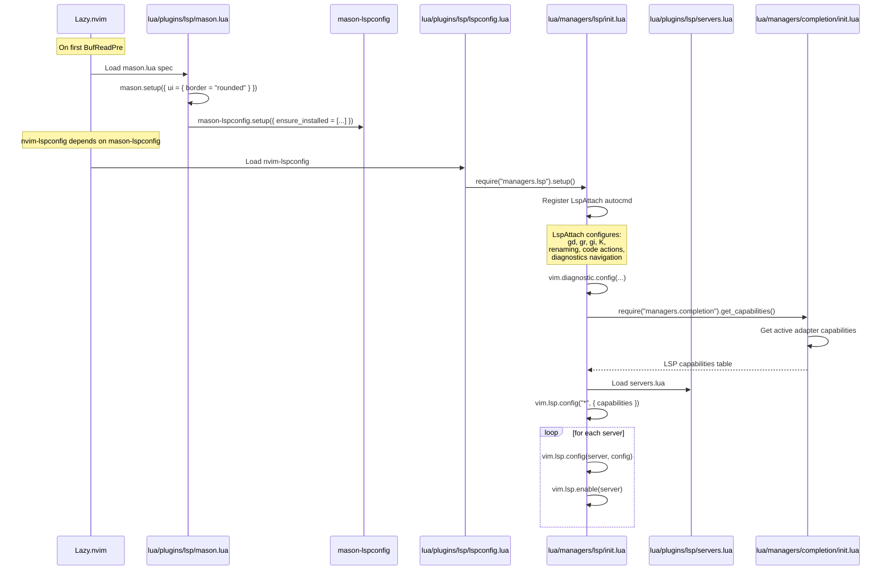

# LSP Workflow

## Initialization

LSP is set up through a chain of plugin configs:



## LSP Attach (Per-Buffer)

When an LSP server attaches to a buffer:

1. **Keymaps are set** (buffer-local):
   - `gd` → definition
   - `gr` → references
   - `gi` → implementation
   - `K` → hover (with styled border)
   - `<leader>rn` → rename
   - `<leader>ca` → code action
   - `[d` / `]d` → diagnostic navigation
   - `<leader>e` → diagnostic float

2. **Completion capabilities** are merged — the completion engine (blink.cmp) receives the server's capabilities.

3. **Diagnostics** begin flowing:
   - Virtual text (prefix + source)
   - Signs in the gutter
   - Underline highlights
   - Severity-sorted

## LSP and Completion Integration

The capability flow:

```
blink.cmp.get_lsp_capabilities()
  → managers.completion.get_capabilities()
    → managers.lsp.setup()
      → vim.lsp.config("*", { capabilities })
```

When the completion engine is switched via `managers.completion.cycle()`, capabilities are re-applied:

```lua
function M.use(name)
  M._active = name
  M._save(name)
  pcall(vim.lsp.config, "*", { capabilities = M.get_capabilities() })
  vim.notify("Completion: " .. name .. " — restart session for full engine swap")
end
```

**Note:** Full engine swap requires a session restart because LSP clients are already initialized with the previous capabilities.

## Troubleshooting LSP

```vim
:LspInfo           " Which servers are running, which buffers attached
:LspLog            " LSP client log
:Mason             " Check server installation status
```

```lua
:lua print(vim.inspect(vim.lsp.get_clients({ bufnr = 0 })))
:lua print(vim.inspect(require("managers.completion").get_capabilities()))
```

---

**See also:** [LSP Plugins](../plugins/lsp.md), [Completion Flow](completion-flow.md), [Diagnostics Flow](diagnostics-flow.md)
