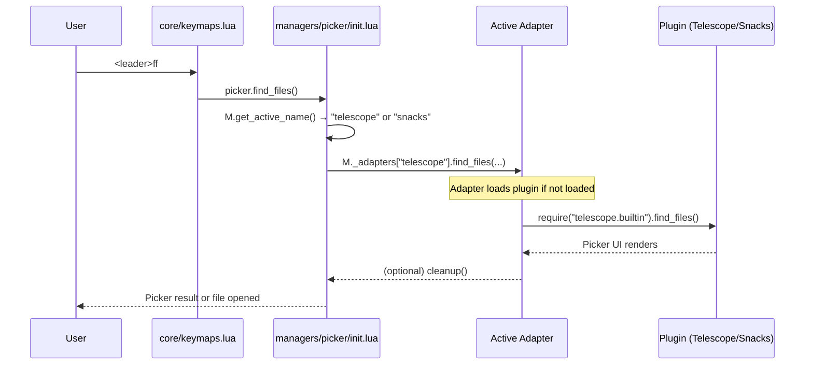

# Search Flow

## Picker Dispatch

When the user presses `<leader>ff`, the following happens:



## Adapter Cleanup

After each picker action, the adapter calls `cleanup()` which unloads the picker plugin's modules from `package.loaded`:

```lua
-- telescope adapter cleanup
local function cleanup()
  for k in pairs(package.loaded) do
    if type(k) == "string" and (k:find("^telescope") or k == "fzf_lib") then
      package.loaded[k] = nil
    end
  end
  -- Also reset lazy.nvim's loaded flag so next action re-triggers loading
  local config = require("lazy.core.config")
  config.plugins["telescope.nvim"]._.loaded = nil
  config.plugins["telescope-fzf-native.nvim"]._.loaded = nil
end
```

This minimizes memory footprint — the picker plugin is loaded only for the duration of the action, then unloaded.

## Available Search Methods

| Method | Telescope Adapter | Snacks Adapter |
|---|---|---|
| `find_files` | `telescope.builtin.find_files` | `snacks.picker.files` |
| `live_grep` | `telescope.builtin.live_grep` | `snacks.picker.grep` |
| `buffers` | `telescope.builtin.buffers` | `snacks.picker.buffers` |
| `oldfiles` | `telescope.builtin.oldfiles` | `snacks.picker.recent` |
| `help_tags` | `telescope.builtin.help_tags` | `snacks.picker.help` |
| `git_files` | `telescope.builtin.git_files` | `snacks.picker.git_files` |
| `git_commits` | `telescope.builtin.git_commits` | `snacks.picker.git_log` |
| `references` | `telescope.builtin.lsp_references` | `snacks.picker.lsp_references` |

## Switching at Runtime

```lua
:lua require("managers.picker").cycle()
```

Or via `<leader>fp`. The switch is immediate — subsequent picker actions use the new adapter. The previous adapter's modules are unloaded via `cleanup()`.

---

**See also:** [Picker Adapter System](../architecture/abstractions.md#2-picker-adapter-system-managerspicker), [Search Plugins](../plugins/search.md)
